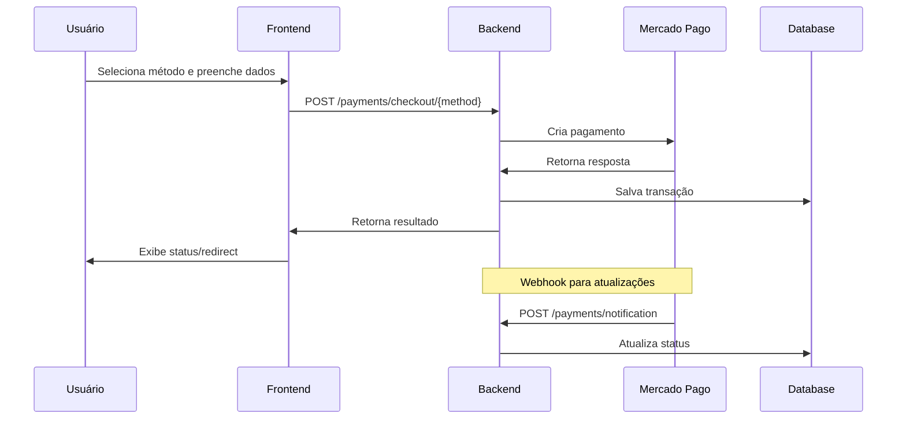

# 💳 Checkout Mercado Pago

<p align="center">
  
  
  
  
  
  
</p>

<p align="center">
  
  
</p>

<p align="center">
  
</p>

## 📋 Sobre o Projeto

O **Checkout Mercado Pago** é um projeto de estudo focado na integração com a API de pagamentos do Mercado Pago. Desenvolvido com **FastAPI** e **Python**, este sistema demonstra como implementar um gateway de pagamento completo, suportando múltiplos métodos de pagamento incluindo PIX, Cartão de Crédito e Boleto Bancário.

### ✨ Principais Características

- 🎯 **Múltiplos Métodos de Pagamento**: PIX, Cartão de Crédito e Boleto
- 🔒 **Integração Segura**: Utiliza tokens e chaves de acesso do Mercado Pago
- 📱 **Interface Responsiva**: Checkout moderno com Jinja2, HTML, CSS, Javascript 
- 🔄 **Webhooks**: Sistema de notificações automáticas para atualizações de status
- 📊 **Persistência de Dados**: Armazenamento de transações com SQLAlchemy
- 🏗️ **Arquitetura Modular**: Separação clara de responsabilidades

## 🛠️ Tecnologias Utilizadas

- **Backend**: Python 3.11+, FastAPI
- **Banco de Dados**: SQLAlchemy, Alembic (Migrations)
- **Frontend**: HTML5, CSS, JavaScript, Jinja2
- **Gateway**: Mercado Pago API

## 🚀 Funcionalidades

### 💰 Métodos de Pagamento

#### PIX
- ✅ Geração de QR Code automática
- ✅ Expiração configurável (30 minutos)
- ✅ Notificação em tempo real

#### 💳 Cartão de Crédito
- ✅ Tokenização segura do cartão
- ✅ Parcelamento configurável
- ✅ Validação de dados do cartão
- ✅ Aprovação/Rejeição instantânea

#### 📄 Boleto Bancário
- ✅ Geração automática do boleto
- ✅ Dados completos do pagador
- ✅ Prazo de vencimento configurável

### 🔧 Recursos Técnicos

- **API RESTful** com documentação automática (Swagger)
- **Sistema de Webhooks** para notificações do Mercado Pago
- **Validação robusta** de dados com Pydantic
- **Tratamento de erros** personalizado
- **Logs detalhados** para debugging
- **Ambiente de desenvolvimento** completo

## 🎣 Webhooks: Recebendo Notificações em Tempo Real

Uma das funcionalidades cruciais deste projeto é a capacidade de receber notificações via **webhooks do Mercado Pago**. Isso permite que nossa aplicação seja informada sobre atualizações nos pagamentos de forma **assíncrona** e **imediata**.

### Como funciona?

#### 1. Configuração
Uma URL da nossa aplicação é registrada na plataforma do **Mercado Pago** como um **endpoint de webhook**.

#### 2. Notificação
Quando um evento ocorre (ex: um cliente paga um boleto ou um pagamento de cartão é aprovado), o **Mercado Pago envia uma notificação** (um `POST` request) para essa URL.

#### 3. Processamento
A aplicação:
- recebe a notificação,
- verifica sua autenticidade,
- utiliza os dados para **atualizar o status do pagamento** correspondente no banco de dados.

✅ Esse mecanismo garante que o **status dos pagamentos** em nosso sistema esteja **sempre sincronizado** com o Mercado Pago, **sem a necessidade de consultar a API repetidamente**.

## � Estrutura do Projeto

```
├── app/
│   ├── __init__.py
│   ├── main.py              # Aplicação principal FastAPI
│   ├── settings.py          # Configurações e variáveis de ambiente
│   ├── database.py          # Configuração do banco de dados
│   ├── dependencies.py      # Dependências injetáveis
│   └── migrations/          # Migrações do Alembic
├── payments/
│   ├── __init__.py
│   ├── models.py           # Modelos SQLAlchemy
│   ├── schemas.py          # Schemas Pydantic
│   └── router.py           # Rotas de pagamento
├── services/
│   ├── __init__.py
│   └── mercadopago.py      # Serviço de integração MP
├── templates/
│   └── checkout.html       # Interface de checkout
├── requirements.txt        # Dependências do projeto
├── pyproject.toml         # Configurações do projeto
└── alembic.ini           # Configuração do Alembic
```

## ⚙️ Configuração do Ambiente

### 1. Clone o repositório
```bash
git clone https://github.com/Kauanrodrigues01/integracao-pagamento-mercado-pago.git
cd integracao-pagamento-mercado-pago
```

### 2. Crie um ambiente virtual
```bash
python -m venv venv
# Windows
venv\Scripts\activate
# Linux/Mac
source venv/bin/activate
```

### 3. Instale as dependências
```bash
pip install -r requirements.txt
```

### 4. Configure as variáveis de ambiente
Crie um arquivo `.env` na raiz do projeto:

```env
# Credenciais do Mercado Pago (Sandbox)
MP_PUBLIC_KEY=your_public_key_here
MP_ACCESS_TOKEN=your_access_token_here

# URLs de configuração
MP_BASE_API_URL=https://api.mercadopago.com
NOTIFICATION_URL=https://your-domain.com/payments/notification

# Configurações gerais
DEFAULT_TIMEZONE=America/Sao_Paulo
DATABASE_URL=sqlite:///./database.db
```

### 5. Execute as migrações
```bash
alembic upgrade head
```

### 6. Inicie o servidor
```bash
uvicorn app.main:app --reload
```

## � Obtendo Credenciais do Mercado Pago

1. Acesse o [Portal de Desenvolvedores do Mercado Pago](https://www.mercadopago.com.br/developers)
2. Crie uma conta ou faça login
3. Acesse "Suas aplicações" > "Criar aplicação"
4. Obtenha suas credenciais de **teste**:
   - **Public Key**: Para operações no frontend
   - **Access Token**: Para operações no backend

> ⚠️ **Importante**: Este projeto está configurado para o ambiente de **teste** (sandbox) do Mercado Pago.

## 📡 Endpoints da API

### Pagamentos

| Método | Endpoint | Descrição |
|--------|----------|-----------|
| `POST` | `/payments/checkout/pix` | Criar pagamento PIX |
| `POST` | `/payments/checkout/boleto` | Criar pagamento Boleto |
| `POST` | `/payments/checkout/card` | Criar pagamento Cartão |
| `POST` | `/payments/notification` | Webhook para notificações |
| `GET` | `/payments/list` | Listar todos os pagamentos |
| `DELETE` | `/payments/delete/{id}` | Deletar pagamento |

### Interface

| Método | Endpoint | Descrição |
|--------|----------|-----------|
| `GET` | `/` | Página de checkout |
| `GET` | `/docs` | Documentação da API (Swagger) |

## 🧪 Testando o Sistema

### 1. Acesse a interface de checkout
```
http://localhost:8000
```

### 2. Dados de teste para Cartão de Crédito

**Cartão Aprovado**:
- Número: `5031433215406351`
- Vencimento: `11/2030`
- CVV: `143`
- Nome: `Test User`

**Cartão Rejeitado**:
- Número: `5031433215406351`
- Vencimento: `11/2030`
- CVV: `143`
- Nome: `Other User`

### 3. Dados de teste para PIX e Boleto
- **CPF**: `12345678909`
- **Email**: `test@test.com`

## 📊 Fluxo de Pagamento



## 🎨 Interface do Usuário

A interface de checkout foi desenvolvida com foco na experiência do usuário:

- **Design Responsivo**: Funciona em desktop e mobile
- **Validação em Tempo Real**: Feedback imediato para o usuário
- **Estados Visuais**: Loading, sucesso e erro
- **Múltiplos Métodos**: Alternância fluida entre PIX, Cartão e Boleto

## 🐛 Tratamento de Erros

O sistema inclui tratamento robusto de erros:

- **Validação de Dados**: Pydantic schemas
- **Erros da API**: Mapeamento de códigos de erro do MP
- **Timeouts**: Configuração de timeout para requisições
- **Logs**: Sistema de logging para debugging

## 📈 Status de Pagamento

| Status | Descrição |
|--------|-----------|
| `pending` | Pagamento pendente |
| `approved` | Pagamento aprovado |
| `rejected` | Pagamento rejeitado |
| `cancelled` | Pagamento cancelado |

## 🔮 Próximos Passos

- [ ] Implementar testes unitários
- [ ] Adicionar autenticação de usuários
- [ ] Dashboard administrativo
- [ ] Relatórios de transações
- [ ] Integração com outros gateways
- [ ] Dockerização do projeto

## 🤝 Contribuindo

1. Faça um fork do projeto
2. Crie uma branch para sua feature (`git checkout -b feature/nova-feature`)
3. Commit suas mudanças (`git commit -am 'Adiciona nova feature'`)
4. Push para a branch (`git push origin feature/nova-feature`)
5. Abra um Pull Request

## 📝 Licença

Este projeto está sob a licença MIT. Veja o arquivo [LICENSE](LICENSE) para mais detalhes.

## 👨‍💻 Autor

**Kauan Rodrigues Lima**

- GitHub: [@Kauanrodrigues01](https://github.com/Kauanrodrigues01)
- LinkedIn: [Kauan Rodrigues](https://www.linkedin.com/in/kauan-rodrigues-lima/)

---

⭐ **Deixe uma estrela se este projeto te ajudou!**

## 📚 Recursos Úteis

- [Documentação do Mercado Pago](https://www.mercadopago.com.br/developers/pt/docs)
- [FastAPI Documentation](https://fastapi.tiangolo.com/)
- [SQLAlchemy Documentation](https://docs.sqlalchemy.org/)
- [Pydantic Documentation](https://docs.pydantic.dev/)
